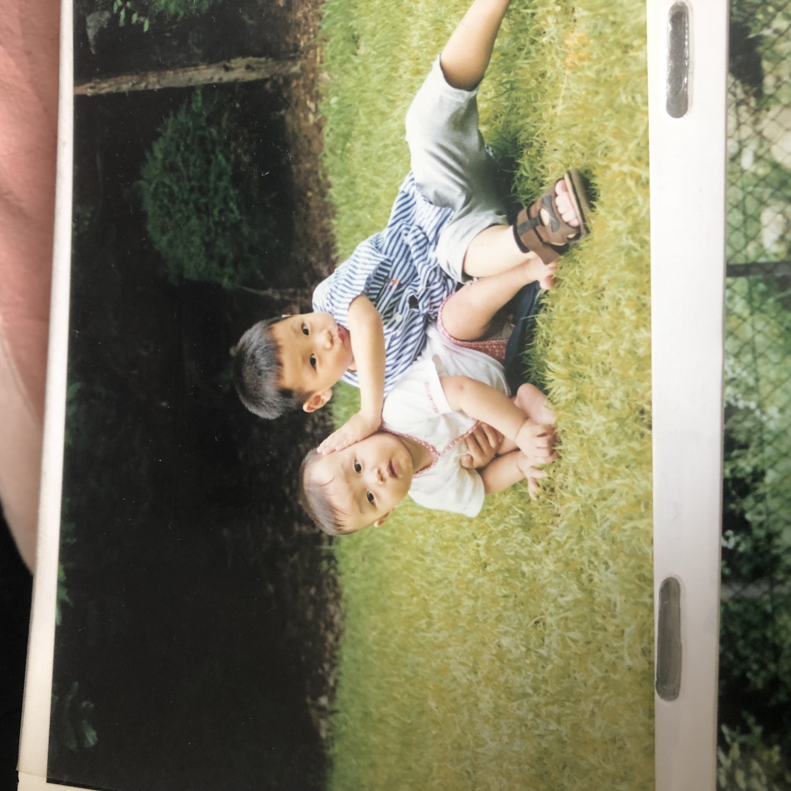
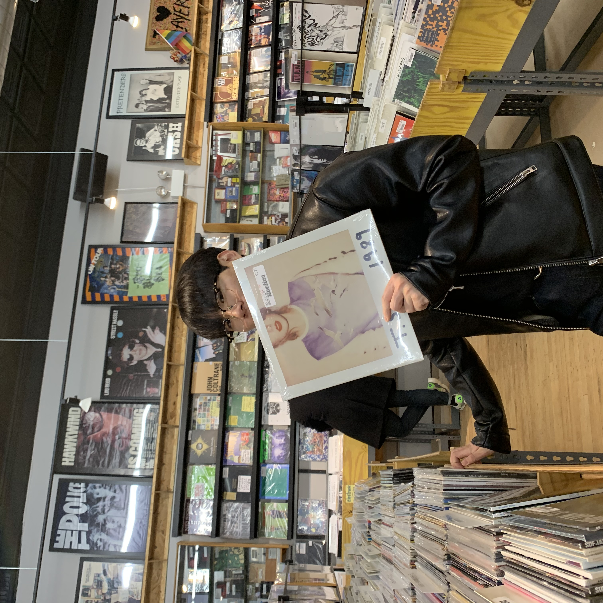

# Wonhee (Steven) Shin

## Where are you from

I am from Cheong-ju, Shouth Korea. It is the city in the center of Korea.

## IT Interest

My father is a semiconductor developer. So since I was a child, I naturally was interested in science and IT. I have liked Steve Jobs since I was a elementary school student. I wanted to be a electronic engineer when I was young, but after talking about my future career with my father for a longtime, I decided to become a safety engineer. He and I talked a lot about current variety of industries and we agreed that safety is important and pormising.
My major in Korea is Safety engineerig.  I have common knowledge about IT fields.

## Something Intersting About You

I am serious when I am working but playful when I am not. I am interested in various fields such as music, movie, design and IT of course.

## Git tutorial

It will be updated.